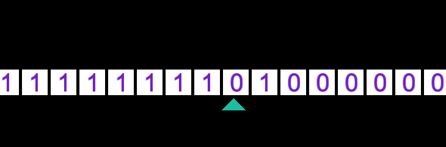

# Turing-machine-SFML

An implementation of a Turing machine in SFML.

The machine is programmed by specifying the rules at the beginning of turing.cpp

2-symbol, 4-state busy beaver program is given as an example but the machine can be extended to an arbitrary number of symbols/states.

Written using SFML 2.5 in C++